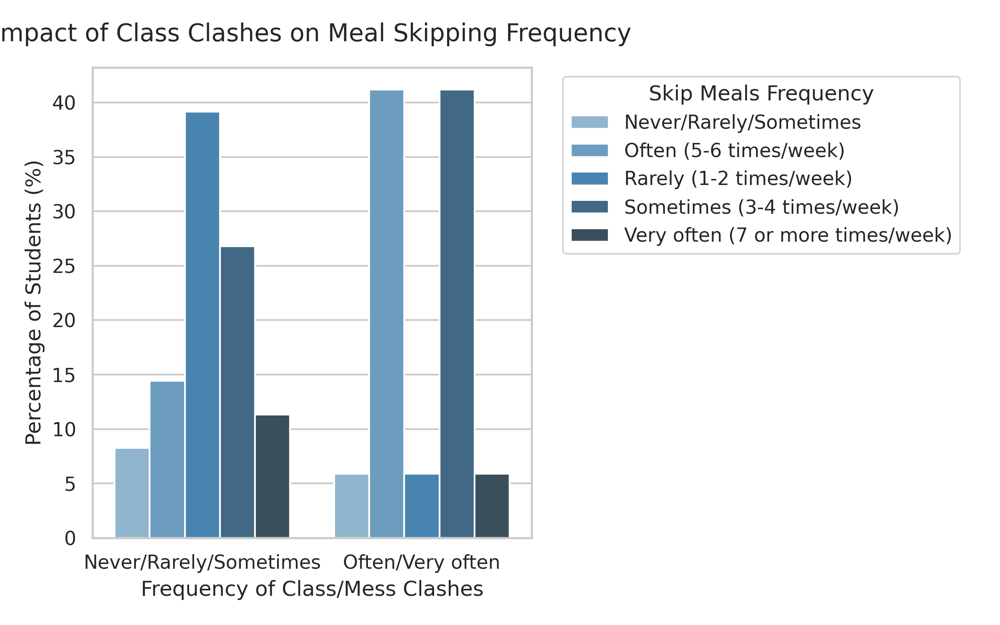
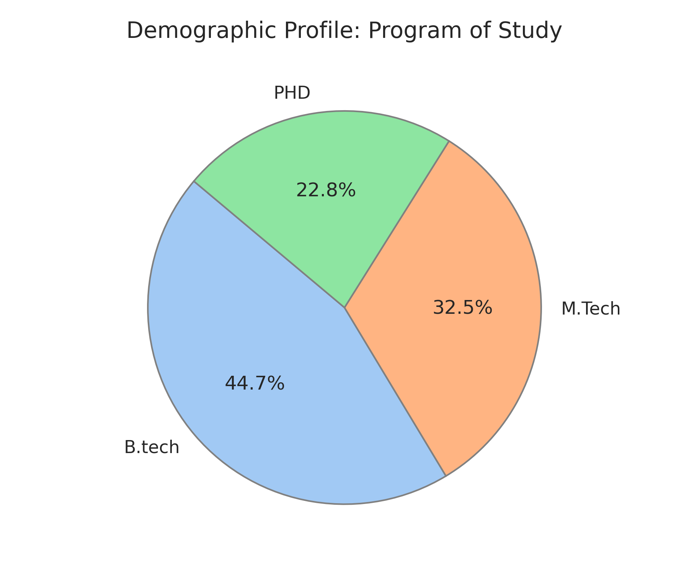
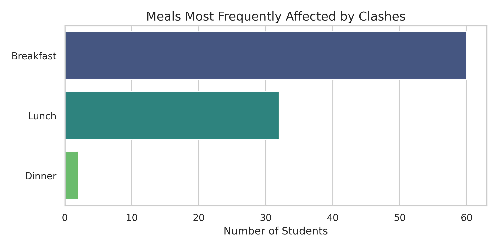
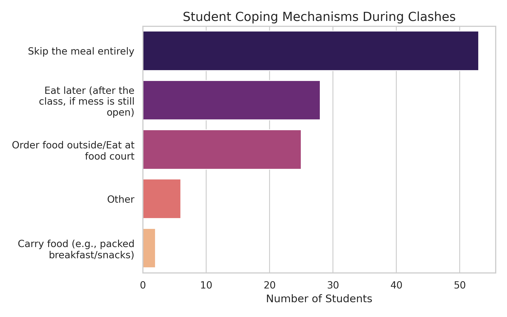
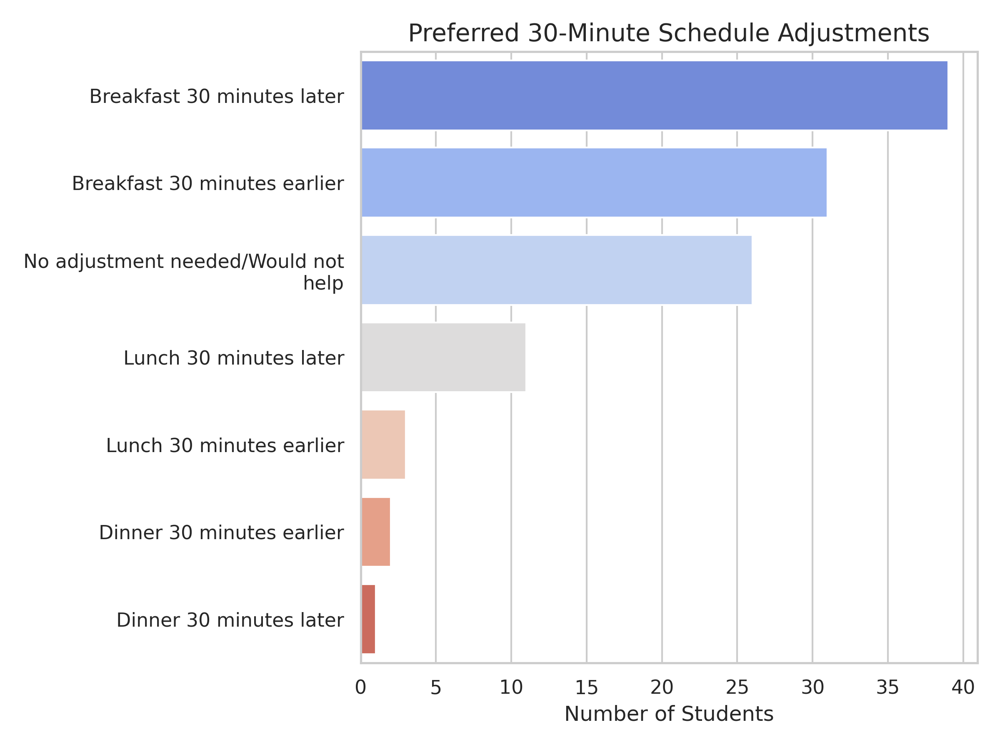

# Hypothesis Testing: Class Schedule vs Meal Skipping

---

## About

This project performs a rigorous statistical analysis to determine whether there is a significant relationship between **class timing clashes and meal-skipping frequency among IIT Patna students**.

The analysis is based on **120 survey responses**. The repository includes the **statistical testing code** (utilizing category collapse, Yates' Continuity Correction, and Fisher's Exact Test) and **data visualization scripts** used to analyze the dataset.

---

## Hypothesis

**Null Hypothesis (H0):** There is no statistically significant relationship between class schedule clashes and meal-skipping frequency.

**Alternate Hypothesis (H1):** IIT Patna students whose class schedule clashes with mess timing skip meals more frequently than students without timing clashes.

**Statistical Methods Used**
* Pearson's Chi-Square Test (with Yates' Continuity Correction on a collapsed 2x2 matrix)
* Fisher's Exact Test (Two-Sided)

**Result**
* **Not Statistically Significant**
* **Chi-Square p-value = 0.2056**
* **Fisher Exact p-value = 0.1594**

Since the p-values are **greater than the 0.05 alpha threshold**, we **fail to reject the null hypothesis**. The data suggests that schedule clashes do not cause a statistically significant increase in complete meal skipping. Instead, visualizations reveal that students utilize secondary coping mechanisms (such as eating at the food court, ordering outside, or eating later) to secure nutrition.
---

##  Setup

### 1️. Install Dependencies

```bash
pip install -r requirements.txt
```

### 2️. Run the Statistical Analysis

```bash
python chi_sq.py
```
---

##  Generated Plots

### Class Schedule Clash vs Meal Skipping



### Student Demographics



### Meals Most Frequently Skipped



### Student Coping Mechanisms



### Proposed Solutions



---
---

## Statistical Method

The testing pipeline validates statistical assumptions before determining significance.

**Raw Evaluation**

A 5×5 Chi-Square test is initially performed. If more than 20% of the expected cell counts are below 5, the test is considered unreliable due to data sparsity.

**Data Transformation**

The original 5-point Likert responses are dichotomized into a 2×2 contingency table ("Low Frequency" vs "High Frequency") to satisfy Chi-Square test assumptions (DF = 1).

**Dual Validation**

Yates' Continuity Correction is applied to the Chi-Square statistic to reduce the risk of overestimating statistical significance. The result is then cross-validated using Fisher's Exact Test.

---

##  Dataset

* **Total Responses:** 120
* **Population:** IIT Patna students
* **Data Type:** Survey-based categorical responses

---

##  Authors

Ayush Dutt
**IIT Patna**

---
